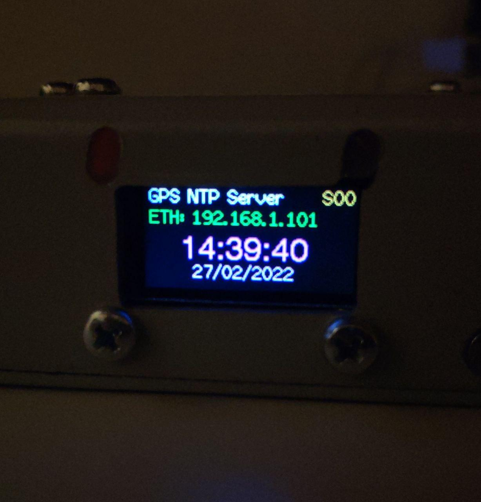

# GPS NTP Server based on WT32-ETH01 (ESP32) and UBLOX

In this repository you will find a small project that implements the `NTP Server`. Date and time are synchronized through `GPS`, accuracy is achieved by means of `PPS`. Devices can work by `WiFi` and` Ethernet`.

## Used Hardware

- GPS: ublox NEO-M8
- Microcontroller: WT32-S
- Ethernet: LAN8720
- Display: ST7735 80x160 TFT
- Antenna: active GPS antenna with 2m wire

## Wiring

```
GPS <-> WT32-ETH01
-----------------
GND --> GND
Tx  --> PIN35 (Rx)
Rx  --> PIN17 (Tx)
PPS --> PIN33 
VCC --> +5V

TFT <-> WT32-ETH01
-----------------
GND  --> GND
VCC  --> +5V
BLK  --> +5V
#MISO --> PIN36
MOSI --> PIN15
SCLK --> PIN14 
DC   --> PIN4 
CS   --> PIN12
RST  --> PIN2
```

## Configuration 

Select connection mode. Choose suitable for you. 
```
//#define OPERATE_AS_AP
//#define OPERATE_AS_STA
//#define OPERATE_AS_ETH
```
In the case of a wireless connection, specify the `ssid`,` pass` 
Since this device doesn't take leap seconds into account, the 'correct' time will be calculated with a simple offset.
This offset affects the microsecond counter so fine control can be achieved.
NOTE that this only ever can be a positive number!
```
#define TIMING_OFFSET_US 0001
```

## A note on accuracy

**Do NOT run your data center from this device! Go and buy a proper NTP server with an atomic clock in it!**  

There is no leap-second check and fine tuning is done via a manual set in a `#define` directive. If you decide to use the device in wifi client mode, the timing accuracy will also depend on the network the device is working on.  
The timing data might be erroneous when the 32-bit microsecond counter value overflows (which happens every 71.583 minutes), or when the GPS decides to send back garbage data due to incorrect information or weak satellite signal.  
Nothing checks whether the GPS data is actually realistic, so if you see on the display that it's 18th of January 1972 or 9th of May 2025, this is the time and date the NTP server will report.

According to my measurements, the achievable timing accuracy is about +/- 50 milliseconds 90% confidence interval when the offset is adjusted correctly.
Sometimes, when the server is processing packets rapidly due to hammering, an extra second delay might be introduced. A normal output with `sntp` should be something like:  
```
$ sntp 192.168.4.1
sntp 4.2.8p10@1.3728-o Tue Mar 21 14:36:42 UTC 2017 (136.200.1~2544)
2019-03-07 16:14:05.328536 (-0400) +0.010 +/- 0.008126 192.168.4.1 s1 no-leap

$ ntpdate -q 192.168.4.1
server 192.168.4.1, stratum 1, offset -0.000596, delay 0.02802
2 Mar 19:13:38 ntpdate[92566]: adjust time server 192.168.4.1 offset -0.000596 sec
```
If you see that the +/- deviation is in the range of a few hundred milliseconds, try syncing time again until you get a few milliseconds like in the example above.


## What's on the display:

- In the first line you can observe the number of active satellites 
- The second line displays the connection type and IP
- Large digits displayed UTC Time 
- The last line displays the current date. 

It is worth noting that the output of information on the screen is not a priority. Accuracy of readings may be unreliable. 




## Credit

https://github.com/ldijkman/WT32-ETH01-LAN-8720-RJ45-

https://github.com/kosma/minmea

https://github.com/UT2UH/PPS-ntp-server

https://github.com/ha5dzs/PPS-ntp-server

https://github.com/DennisSc/PPS-ntp-server

https://wiki.iarduino.ru/page/NMEA-0183/

https://www.youtube.com/watch?v=AADmsRuzRRA

https://github.com/Bodmer/TFT_eSPI
